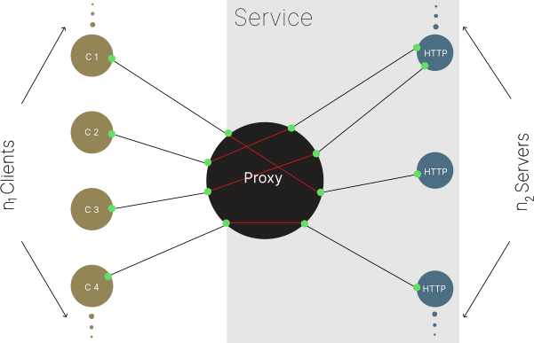

# **Socketnaut** 

*Scalable multithreaded Node.js servers made easy.*

## Introduction
<p align="center">
  
</p>

Socketnaut makes scaling native Node.js servers easy.  A Socketnaut **Service** typically consists of a TCP proxy and a pool of HTTP servers.  Socketnaut will uniformly distribute incoming TCP sockets across the pool of allocated servers.  This strategy allows for both distribution and parallel processing of incoming requests.  Socketnaut consumes native Node.js servers (e.g., `http.Server`, `https.Server`, `net.Server`, `tls.Server`); hence, if you know the [Node API](https://nodejs.org/docs/latest-v18.x/api/http.html), you already know how to build applications on Socketnaut!

Socketnaut can be used in order to scale the **main module** of web applications built on performant Node.js web frameworks (e.g., [Fastify](https://fastify.dev/), [Koa](https://koajs.com/), [Express](https://expressjs.com/)).  Please see the [Examples](#examples) section for instructions on how to do this.

### Features
- **Socketnaut requires 0 out-of-org dependencies**.  Socketnaut's dependencies are published and maintained by the **FAR Analytics and Research** org:  
    - The [`farar/memoir`](https://www.npmjs.com/package/memoir) logger.
    - The [`farar/port_agent`](https://www.npmjs.com/package/port_agent) RPC-like facility for making inter-thread function calls.
- The Socketnaut `ServiceProxy` and `ServiceAgent` constructors consume native Node [`net.Server`](https://nodejs.org/api/net.html#class-netserver), [`http.Server`](https://nodejs.org/api/http.html#class-httpserver), and [`https.Server`](https://nodejs.org/api/https.html#class-httpsserver), and [`tls.Server`](https://nodejs.org/api/tls.html#class-tlsserver) instances; *you can configure them however you choose*.
- Import Socketnaut as a Node.js module (see the [Hello World!](#an-instance-of-hello-world-example) example) or take advantage of the packaged type definitions and import it into your TypeScript project. 

## Table of Contents
1. [Installation](#installation)
2. [Concepts](#concepts)
3. [API](#api)
4. [Usage](#usage)
5. [Examples](#examples)
    - [*An instance of Hello World!*](#an-instance-of-hello-world-example)
    - [*Use Socketnaut to scale the main module of a Fastify web application.*](#use-socketnaut-to-scale-the-main-module-of-a-fastify-web-application-example)
    - [*Use Socketnaut to scale the main module of a Koa web application.*](#use-socketnaut-to-scale-the-main-module-of-a-koa-web-application-example)
    - [*Use Socketnaut to scale the main module of an Express web application.*](#use-socketnaut-to-scale-the-main-module-of-an-express-web-application-example)
    - [*Redirect HTTP connections to an HTTPS server.*](#redirect-http-connections-to-an-https-server-example)
    - [*A TLS Proxy and an HTTP Redirect.*](#a-tls-proxy-and-an-http-redirect-example)
6. [Tuning Strategies](#tuning-strategies)
7. [The Client-Proxy Socket's Remote Address and Port](#the-client-proxy-sockets-remote-address-and-port)
8. [Logging](#logging)

## Installation

```bash
npm install socketnaut
``` 
## Concepts

A Socketnaut **Service** consists of a `ServiceProxy` and a `ServiceAgent`.

### ServiceProxy

A `ServiceProxy` is used in order to bind a TCP server to a specified port (usu. a public port).  A `ServiceProxy` can be instantiated using the `createServiceProxy` function.  The `ServiceProxy` uniformly distributes TCP connections to servers (e.g., HTTP servers) in the worker thread pool.  The `ServiceProxy` manages the thread pool according to the values specified for the `minWorkers` and `maxWorkers` parameters.  

### ServiceAgent

A `ServiceAgent` coordinates the state of its worker thread and server with its respective proxy (e.g., the server's address and worker termination).  A `ServiceAgent` can be instantiated using the `createServiceAgent` function.  It consumes a native Node.js server (e.g., [`net.Server`](https://nodejs.org/api/net.html#class-netserver), [`http.Server`](https://nodejs.org/api/http.html#class-httpserver), [`https.Server`](https://nodejs.org/api/https.html#class-httpsserver), [`tls.Server`](https://nodejs.org/api/tls.html#class-tlsserver)).  The Node.js server provided to the `ServiceAgent` may be used the same way it is used natively; hence, Socketnaut works with many popular Node.js web frameworks. Please see the [Examples](#examples) section for instructions on how to use Socketnaut with native Node.js servers and web application frameworks.

## API

### The `ServiceProxy` Class

#### socketnaut.createServiceProxy(options)
- options `<ServiceProxyOptions>`

    - `maxWorkers` `<number>` Optional argument that specifies the maximum number of worker threads permitted.

    - `minWorkers` `<number>` Optional argument that specifies the minimum number of worker threads permitted. **Default**: `0`

    - `server` `<node:net.Server>` or `<node:tls.Server>` A `net.Server` configured however you choose.

    - `workersCheckingInterval` `<number>` Optional argument that specifies the approximate interval (milliseconds) at which inactive `ServiceAgent`s will be cleaned up. **Default**: `60000`

    - `workerOptions` `<node:worker_threads.WorkerOptions>` Optional `WorkerOptions` passed to the `worker_threads.Worker` constructor.

    - `workerURL` `<string>` or `<URL>` The URL or path to the `.js` module file that contains the `ServiceAgent` instance.  This is the module that will be scaled according to the values specified for `minWorkers` and `maxWorkers`.  Please see the [Examples](#examples) section for how to specify the proxy's `ServiceAgent` module. 

- Returns: `<socketnaut.ServiceProxy>`

Creates a `ServiceProxy`.  Each process may contain any number of `ServiceProxy`s.  However, all `ServiceProxy`s run in the main thread; hence, the number of instances created in each process should be considered carefully.

### The `ServiceAgent` Class

#### socketnaut.createServiceAgent(options)
- options `<ServiceAgentOptions>`

    - `server` `<node:http.Server>` or `<node:https.Server>` or `<node:net.Server>` or `<node:tls.Server>` A native Node.js `Server` configured however you choose.

- Returns: `<socketnaut.ServiceAgent>`

Creates a `ServiceAgent`. Just one `ServiceAgent` may be instantiated for each worker; hence, this function will throw an `Error` if it is called more than once in a module.

#### serviceAgent.requestProxySocketAddressInfo(socket)
- `socket` `<net.Socket>` The socket associated with the `http.IncomingMessage` i.e., `http.IncomingMessage.socket`.  The return value is a `Promise` that will resolve to an object that contains information that describes the proxy's socket tuple (i.e., in most cases this will contain the client's IP address and port). 

- Returns: `<Promise<socketnaut.ProxySocketAddressInfo>>`

## Usage

Each Socketnaut Service consists of at least one `ServiceProxy` and a respective worker module that has a `ServiceAgent` instance.  Please see the [Examples](#examples) section for how to create a Socketnaut Service.

## Examples

### *An instance of Hello World!* <sup><sup>(example)</sup></sup>

This is a complete and simple Socketnaut Service that responds with the text "Hello World!".  **You're looking at an ordinary Node.js web app**, except that a `ServiceProxy` instance is created in the `index.js` module and a `ServiceAgent` instance is created in the scaled `http_server.js` module - *that is all it takes to scale this web app*. Scaling sophisticated web applications is just as easy.  Please see the [Hello World example](https://github.com/faranalytics/socketnaut/tree/main/examples/hello_world) for a working implementation.

`index.js`
```js
import * as net from 'node:net';
import { createServiceProxy } from 'socketnaut';

const server = net.createServer() // Configure this TCP server however you choose.

server.listen({ port: 3080, host: '0.0.0.0' });

const proxy = createServiceProxy({
    server,
    minWorkers: 4,
    maxWorkers: 42,
    workerURL: './http_server.js'
});
```

`http_server.js`
```js
import * as http from 'node:http';
import { createServiceAgent } from 'socketnaut';

const server = http.createServer() // Configure this HTTP Server however you choose.

server.on('request', (req, res) => {
    for (let now = Date.now(), then = now + 100; now < then; now = Date.now()); // Block for 100 milliseconds.
    res.end('Hello World!');
});

server.listen({ port: 0, host: '127.0.0.1' });
// Specifying port 0 here will cause the Server to listen on a random port.
// The Socketnaut Agent will communicate the randomly selected port to the ServiceProxy.

const agent = createServiceAgent({ server });
```
### *Use Socketnaut to scale the main module of a Fastify web application.* <sup><sup>(example)</sup></sup>

Please see the [Fastify example](https://github.com/faranalytics/socketnaut/tree/main/examples/socketnaut_fastify) for a working implementation.

### *Use Socketnaut to scale the main module of a Koa web application.* <sup><sup>(example)</sup></sup>

Please see the [Koa example](https://github.com/faranalytics/socketnaut/tree/main/examples/socketnaut_koa) for a working implementation.

### *Use Socketnaut to scale the main module of an Express web application.* <sup><sup>(example)</sup></sup>

Please see the [Express example](https://github.com/faranalytics/socketnaut/tree/main/examples/socketnaut_express) for a working implementation.

### *Redirect HTTP connections to an HTTPS server.* <sup><sup>(example)</sup></sup>
Please see the [Redirect HTTP to HTTPS example](https://github.com/faranalytics/socketnaut/tree/main/examples/redirect_http_to_https) for a working implementation.

### *A TLS Proxy and an HTTP Redirect.* <sup><sup>(example)</sup></sup>
In the previous example, the TLS endpoint was in the worker thread; however, it doesn't need to be. Alternatively, TLS can be handled by the proxy server. Please see the [A TLS Proxy and an HTTP Redirect example](https://github.com/faranalytics/socketnaut/tree/main/examples/tls_proxy_and_http_redirect) for a working implementation.

## Tuning Strategies

Scaling can be tuned by specifying a minimum and maximum number of allocated worker threads.  The minimum and maximum number of worker threads can be specified in the constructor of each `ServiceProxy` by assigning values to the `minWorkers` and `maxWorkers` parameters.  Further, the `workersCheckingInterval` can be used in order to set the frequency at which inactive worker threads are culled until the `minWorkers` threshold is reached.

### `ServiceProxy` constructor parameters relevant to tuning:
#### socketnaut.createServiceProxy(options)
- options `<ServiceProxyOptions>`
    - `minWorkers` `<number>` Optional argument that specifies the minimum number of worker threads permitted. **Default**: `0`

    - `maxWorkers` `<number>` An argument that specifies the maximum number of worker threads permitted.

    - `workersCheckingInterval` `<number>` An argument that specifies the approximate interval at which inactive `ServiceAgent`s will be cleaned up. **Default**: `60000`

The `minWorkers` argument specifies the minimum number of worker threads to be permitted in the thread pool.  `minWorkers` worker threads will be instantiated when the Socketnaut proxy starts.  Socketnaut will not allow the thread pool to drop below the specified threshold.  However, if a worker thread throws an uncaught exception, Socketnaut will not attempt to automatically restart it, which could result in a thread pool below the specified threshold.

The `maxWorkers` argument is a hard limit on *online* threads; however, because thread termination is asynchronous it is possible for the combined count of online and liminal threads to briefly exceed this limit.

The `workersCheckingInterval` specifies the approximate interval at which Socketnaut will attempt to clean up inactive worker threads.  If Socketnaut's proxy finds that a thread has 0 connections, Socketnaut will remove it from the pool and send it a notification requesting that it exit.  The default interval is `60000` milliseconds.

By variously specifying `minWorkers`, `maxWorkers`, and `workersCheckingInterval` you can tune Socketnaut according to the requirements of your environment.

## The Client-Proxy Socket's Remote Address and Port

Socketnaut provides a facility for obtaining information about the client-proxy socket.  When a proxied request is made to an `http.Server`, the `request` handler is passed a `http.IncomingMessage`.  The remote address of the socket, accessed using `http.IncomingMessage.socket.remoteAddress`, will provide the remote address of the proxy (usu. 127.0.0.1) - not the remote address of the client.  Implementations such as **Proxy Protocol** and the `Forwarded` HTTP header are commonly used in order to address this issue.  However, Socketnaut's `ServiceProxy` is a Layer 4 proxy, and the payload may or may not contain encrypted data; hence, it isn't always possible to inject an HTTP header into the message - *the payload may not even be HTTP*.

Socketnaut solves this problem by providing a `MessageChannel` facility for requesting information about the client-proxy socket. Call the `ServiceAgent.requestProxySocketAddressInfo` method with the request socket (e.g., `req.socket`) as an argument.  The method will return a `Promise` that resolves to a `socketnaut.ProxySocketAddressInfo` object that contains information that describes the proxy's socket tuple.

### Example

```ts
const server = http.createServer();

const agent = createServiceAgent({ server });

server.on('request', async (req: http.IncomingMessage, res: http.ServerResponse) => {
    const proxySocketAddressInfo = await agent.requestProxySocketAddressInfo(req.socket);
    console.log(proxySocketAddressInfo);
    /* Output
    {
        local: { address: '192.0.2.1', family: 'IPv4', port: 3443 },
        remote: { address: '198.51.100.1', family: 'IPv4', port: 35798 }
    }
    */
    res.end();
});
```

The information returned by the `ServiceAgent.requestProxySocketAddressInfo` method can be used in order to associate the remote client address and port with each HTTP request e.g., for logging purposes.

## Logging

Socketnaut uses the Node.js `memoir` logging facility.  Each `ServiceProxy` and `ServiceAgent` has its own `memoir` Logger and Handler instances, which can be accessed by the public properties `log` and `logHandler` respectively.  You can set the log level on the Logger itself to `DEBUG` | `INFO` | `WARN` | `ERROR` using the `setLevel` method.  The default is `INFO`.  For example:

`index.js`
```js
import { Level } from 'socketnaut';
...
proxy.log.setLevel(Level.DEBUG)
```
or

`http_server.js`
```js
import { Level } from 'socketnaut';
...
service.log.setLevel(Level.DEBUG)
```