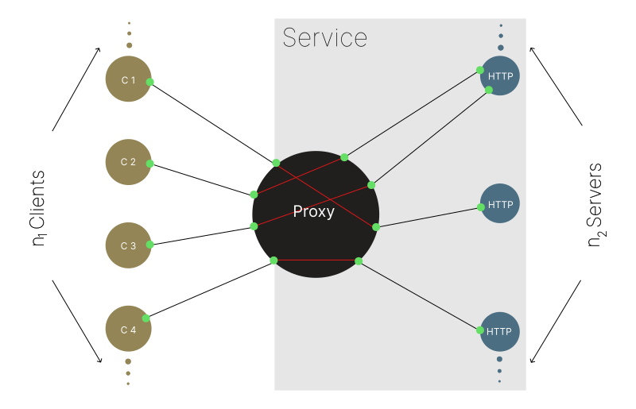

# **Socketnaut** 

Scalable multithreaded Node.js servers made easy.



Socketnaut makes scaling native Node.js servers (e.g., HTTP, HTTPS, TCP) easy.  Each Socketnaut **Service** consists of a TCP Proxy and a pool of HTTP servers.  When the server pool is exhausted, Socketnaut will uniformly distribute incoming TCP sockets across the pool of allocated servers.  This strategy allows for both distribution and parallel processing of incoming requests.  Socketnaut exposes the same API for HTTP requests provided by Node's `http.Server` and `https.Server`; hence, if you know the [Node API](https://nodejs.org/docs/latest-v18.x/api/http.html), you already know how to build applications on Socketnaut!

Socketnaut can be used in order to scale the *main thread* of performant Node.js HTTP servers (e.g., Fastify).

## Features
- **Socketnaut requires 0 out-of-org dependencies**.  Socketnaut's dependencies are published and maintained by the **FAR Analytics and Research** org.  
Dependencies:
    - The [`farar/memoir`](https://www.npmjs.com/package/memoir) logger.
    - The [`farar/port_agent`](https://www.npmjs.com/package/port_agent) RPC facility.
- The Socketnaut `ServiceProxy` and `ServiceAgent` constructors consume native Node [`net.Server`](https://nodejs.org/docs/latest-v18.x/api/net.html), [`http.Server`](https://nodejs.org/docs/latest-v18.x/api/http.html), and [`https.Server`](https://nodejs.org/docs/latest-v18.x/api/https.html) instances; *you can configure them however you choose*.
- The [`http.IncomingMessage`](https://nodejs.org/docs/latest-v18.x/api/http.html#class-httpincomingmessage) and [`http.ServerResponse`](https://nodejs.org/docs/latest-v18.x/api/http.html#class-httpserverresponse) objects passed to `request` listeners are unadulterated native Node objects - nothing added - nothing removed.
- Import Socketnaut as a Node.js module (see the [Hello World!](#an-instance-of-hello-world-example) example) or take advantage of the packaged type definitions and import it into your TypeScript project. 

## Table of Contents
1. [Installation](#installation)
2. [Concepts](#concepts)
3. [API](#api)
4. [Usage](#usage)
5. [Examples](#examples)
    - [*An instance of Hello World!*](#an-instance-of-hello-world-example)
    - [*Use Socketnaut to scale the main thread of a Fastify server.*](#use-socketnaut-to-scale-the-main-thread-of-a-fastify-server-example)
    - [*Use Socketnaut to scale the main thread of an Express server.*](#use-socketnaut-to-scale-the-main-thread-of-an-express-server-example)
6. [Tuning Strategies](#tuning-strategies)
7. [Logging](#logging)
8. [FAQ](#faq)

## Installation

```bash
npm install socketnaut
``` 
## Concepts

A Socketnaut **Service** consists of a `ServiceProxy` and a `ServiceAgent`.

### ServiceProxy

A `ServiceProxy` is used in order to bind a TCP server to a specified port (usu. a public port).  A `ServiceProxy` can be instantiated using the `createServiceProxy` function.  The `ServiceProxy` uniformly distributes TCP connections to `ServiceAgent`s (e.g., HTTP servers) in the thread pool.  The `ServiceProxy` manages the thread pool according to the values specified for the `minWorkers` and `maxWorkers` parameters.  

### ServiceAgent

A `ServiceAgent` coordinates with its respective Proxy (e.g., module scaling and termination).  A `ServiceAgent` can be instantiated using the `instantiateServiceAgent` function.  It can consume a native Node.js server (e.g., HTTP, HTTPS, TCP).  The "wrapped" Node.js server is used the same way it is used natively; it can even be passed into an external routing facility or provided to a web application framework; please see the [Examples](#examples) section for instruction on how to do this. 

## API

### The `ServiceProxy` Class

#### socketnaut.createServiceProxy(options)
- options `<ServiceProxyOptions>`

    - `maxWorkers` `<number>` Optional argument that specifies the maximum number of `ServiceAgent` Worker threads permitted.

    - `minWorkers` `<number>` Optional argument that specifies the minimum number of `ServiceAgent` Worker threads permitted. **Default**: `0`

    - `server` `<node:net.Server>` A `net.Server` configured however you choose.

    - `workersCheckingInterval` `<number>` Optional argument that specifies the approximate interval (milliseconds) at which inactive `ServiceAgent`s will be cleaned up. **Default**: `60000`

    - `workerOptions` `<node:worker_threads.WorkerOptions>` Optional `WorkerOptions` passed to the `worker_threads.Worker` constructor.

    - `workerURL` `<string>` or `<URL>` The URL or path to the `.js` module file that contains the `ServiceAgent` instance.  This is the module that will be scaled according to the values specified for `minWorkers` and `maxWorkers`.  Please see the [Examples](#examples) section for how to reference a `ServiceAgent` module. 

- Returns: `<socketnaut.ServiceProxy>`

Creates a `ServiceProxy`.  Each process may contain any number of `ServiceProxy`s.  However, all `ServiceProxy`s run in the main thread; hence, the number of instances created in each process should be considered carefully.

### The `ServiceAgent` Class

#### socketnaut.instantiateServiceAgent(options)
- options `<ServiceAgentOptions>`

    - `server` `<node:http.Server>` or `<node:https.Server>` or `<node:net.Server>` A native Node.js `Server` configured however you choose.

- Returns: `<socketnaut.ServiceAgent>`

Instatiates a `ServiceAgent`. Just one `ServiceAgent` may be instantiated for each Worker; hence, this function will throw an Error if it is called more than once in each Worker.

## Usage

Each Socketnaut Service consists of at least one `ServiceProxy` and a respective `ServiceAgent`.  Please see the [examples](#examples) section for how to create a Socketnaut Service.

## Examples

### *An instance of Hello World!* <sup><sup>(example)</sup></sup>

`index.js`
```js
import * as net from 'node:net';
import { createServiceProxy } from 'socketnaut';

const proxy = new createServiceProxy({
    server: net.createServer(),
    minWorkers: 42,
    maxWorkers: 100,
    workersCheckingInterval: 1e6,
    workerURL: './http_server.js'
});

proxy.server.listen({ port: 3000, host: '0.0.0.0' });
```

`http_server.js`
```js
import * as http from 'node:http';
import { instantiateServiceAgent } from 'socketnaut';

const service = new instantiateServiceAgent({
    server: http.createServer() // Configure this HTTP server however you choose.
});

service.server.on('request', (req, res) => {
    for (let now = Date.now(), then = now + 100; now < then; now = Date.now()); // Block for 100 milliseconds.
    res.end('Hello World!');
});

service.server.listen({ port: 0, host: '127.0.0.1' });
// Specifying port 0 here will cause the Server to listen on a random port.
// Socketnaut will communicate the random port number to the ServiceProxy.
```
### *Use Socketnaut to scale the main thread of a Fastify server.* <sup><sup>(example)</sup></sup>

Please see the [Fastify](https://github.com/faranalytics/socketnaut/tree/main/examples/socketnaut_fastify) example for a working implementation.

### *Use Socketnaut to scale the main thread of an Express server.* <sup><sup>(example)</sup></sup>

Please see the [Express](https://github.com/faranalytics/socketnaut/tree/main/examples/socketnaut_express) example for a working implementation.

## Tuning Strategies

Socketnaut scaling can be tuned by specifying a minimum and maximum number of allocated `ServiceAgent` Worker threads.  The minimum and maximum number of `ServiceAgent` threads can be specified in the constructor of each `ServiceProxy` by assigning values to the `minWorkers` and `maxWorkers` parameters.  Further, the `workersCheckingInterval` can be used in order to set the frequency at which Worker threads are culled until the `minWorkers` threshold is reached.

### `ServiceProxy` constructor parameters relevant to tuning:
#### socketnaut.createServiceProxy(options)
- options `<ServiceProxyOptions>`
    - `minWorkers` `<number>` Optional argument that specifies the minimum number of `ServiceAgent` Worker threads permitted. **Default**: `0`

    - `maxWorkers` `<number>` An argument that specifies the maximum number of `ServiceAgent` threads permitted.

    - `workersCheckingInterval` `<number>` An argument that specifies the approximate interval at which inactive `ServiceAgent`s will be cleaned up. **Default**: `60000`

The `minWorkers` argument specifies the minimum number of Worker threads permitted.  `minWorkers` threads will be instantiated when the Socketnaut Proxy starts.  Socketnaut will not allow the thread pool to drop below the specified threshold.

The `maxWorkers` argument is a hard limit. 

The `workersCheckingInterval` specifies the approximate interval at which Socketnaut will attempt to clean up inactive Worker threads.  If Socketnaut's Proxy finds that a thread has 0 connections, Socketnaut will remove it from the pool and send it a notification requesting that it close its server and exit.  The default interval is `60000` milliseconds.

By variously specifying `minWorkers`, `maxWorkers`, `workersCheckingInterval` you can tune Socketnaut according to the requirements of your environment.

## Logging

Socketnaut uses the Node.js `memoir` logging facility.  You can set Socketnaut's log level in your `index.js` by importing the memoir `consoleHandler` and setting it's `logLevel` to `DEBUG` | `INFO` | `WARN` | `ERROR`.  The default is `INFO`.  For example:

`index.js`
```js
import { consoleHandler, Level } from 'socketnaut';

consoleHandler.setLevel(Level['DEBUG']);
```

Socketnaut exports its instance of a `memoir` logger, named `socketlog`, which can be consumed and reconfigured by another `memoir` logger; see the `memoir` documentation for how to do this - *or use the logger of your choice*.

## FAQ

### What kind of scaling implementation is this?
Socketnaut is a multithreaded *vertical* scaling implementation. However, Socketnaut could be containerized and scaled horizontally.